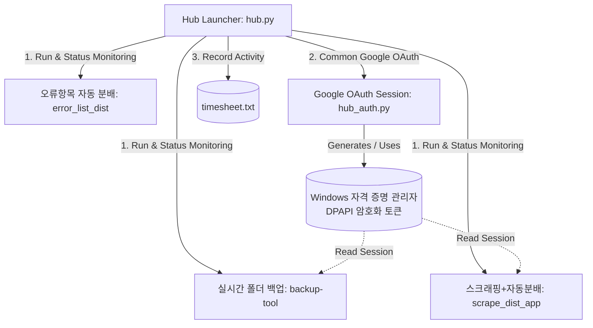

# 🎛️ el-hub: 학위논문 검업 및 납품 자동화 도구 모음

> 본 워크스페이스는 학위논문 검토, 데이터 정제, 자동 분배, 그리고 실시간 백업까지의 전체 납품 프로세스를 자동화하고 통합 제어하기 위한 **통합 앱 허브(App Hub)** 프로젝트입니다.

---

## 🏗️ 시스템 아키텍처 (Architecture)

`el-hub`는 메인 런처인 `hub.py`를 대시보드로 삼아, 여러 개의 독립적인 Python/PySide6 기반 자동화 도구들을 한곳에서 실행하고 제어할 수 있도록 설계되었습니다.



---

## 📦 구성 모듈 및 하위 프로젝트

이 워크스페이스는 유기적으로 연동되는 **3가지 핵심 도구**와 **1개의 공통 인증 모듈**로 구성되어 있습니다.

### 1. 🎛️ 통합 허브 런처 (`hub.py` / `hub_auth.py`)
하위 모든 도구를 일괄 실행하고 모니터링하는 중앙 관리자입니다.
- **프로세스 감시 및 윈도우 포커싱**: 하위 앱들의 실행 상태를 모니터링하여 가동 중에는 "열기", 미실행 상태에는 "실행" 버튼을 동적으로 활성화합니다. 이미 실행된 앱의 버튼을 클릭할 경우 DWM(Desktop Window Manager) API를 이용해 해당 창을 최상위로 가져옵니다(Bring to Front).
- **공유 구글 OAuth 세션**: OAuth 토큰을 DPAPI로 암호화해 Windows 자격 증명 관리자(`AutoHub-GoogleOAuth`)에 저장·공유하므로, 허브에서 한 번 로그인하면 `backup-tool`과 `scrape_dist_app`에서 추가 로그인 없이 연동 작업을 수행합니다.
- **작업자 출퇴근 기록**: 로그인된 계정과 연동하여 작업 일시, 계정명, 출근/퇴근 상태를 `timesheet.txt`에 탭(`\t`)으로 구분하여 안전하게 누적 기록합니다.

### 2. 📂 실시간 폴더 백업 ([backup-tool](file:///c:/Users/User/Desktop/work/template/auto/backup-tool/README.md))
- 작업 중인 소스 폴더를 실시간 모니터링하여 날짜별 폴더(`YYYYMMDD/`)에 안전하게 누적 복사합니다.
- 원본에서 파일이 삭제되어도 백업본은 삭제하지 않는 누적 모드를 채택하여 안전성을 확보합니다.
- 1시간 주기로 변경 및 추가된 파일만을 추적해 Google Drive 지정 폴더로 자동 업로드합니다.

### 3. 🕸️ 스크래핑 및 자동분배 ([scrape_dist_app](file:///c:/Users/User/Desktop/work/template/auto/scrape_dist_app/README.md))
- Google Sheets 등 외부 웹 소스에서 원격 데이터를 실시간으로 수집하고 다운로드합니다.
- 다운로드한 대용량 로우(raw) 데이터를 자체 정제 기준에 맞춰 필터링 및 서식 작업을 적용합니다.

### 4. 📊 오류항목 자동 분배 ([error_list_dist](file:///c:/Users/User/Desktop/work/template/auto/error_list_dist/README.md))
- 입력된 오류 리스트 엑셀 문서를 **제어번호(B열)** 기준으로 일괄 병합합니다.
- 오탈자, 띄어쓰기 등 단순 오류를 탐지하여 3차/품질점검에 우선 분배하고 나머지는 2차로 정렬합니다.
- 수정 전/후의 글자 차이를 시각적으로 구별해주는 Rich Text 스타일링(색상 차이 강조) 작업을 자동 적용합니다.

---

## 🚀 시작하기

### 1. 사전 요구사항 (Prerequisites)
본 프로젝트는 **Python 3.8 이상** 환경에서 구동됩니다.
각 하위 폴더별로 독자적인 가상환경(`.venv`)을 갖추고 있을 경우, 허브가 가상환경 안의 Python 인터프리터를 탐지하여 우선적으로 실행합니다. 가상환경이 없으면 `uv run` 또는 글로벌 파이썬을 자동으로 찾아 폴백 실행합니다.

### 2. 패키지 설치
최상위 폴더 및 각 하위 프로젝트의 라이브러리 의존성을 설치합니다.
```bash
# 최상위 허브 의존성 설치
pip install -r requirements.txt
```

### 3. 구글 클라우드 자격 증명 설정
구글 드라이브 동기화 및 구글 시트 스크래핑을 사용하려면 OAuth API 설정이 필요합니다.
- **[Google Cloud Console](https://console.cloud.google.com/)**에서 데스크톱 애플리케이션으로 OAuth 사용자 인증 정보를 생성합니다.
- 다운로드받은 키 파일의 이름을 `oauth_client.json`으로 변경하여 **`credentials/oauth_client.json`** 경로에 위치시킵니다.

> [!WARNING]
> `credentials/` 내부의 자격 증명 파일들과 `timesheet.txt`는 민감한 사용자 정보와 API 비밀 키를 포함하고 있으므로, **Git 원격 저장소에 업로드하지 마십시오**. 해당 파일들은 루트의 `.gitignore`를 통해 기본적으로 차단되도록 사전 설정되어 있습니다.

### 4. 허브 실행
```bash
python hub.py
```

---

## 📝 출퇴근 기록 포맷 (`timesheet.txt`)

출퇴근 기능 작동 시 최상위 폴더에 자동 생성되는 `timesheet.txt` 파일은 다음과 같은 포맷으로 기록됩니다.
```
2026-06-09 09:00:21    voll1212@naver.com    출근
2026-06-09 18:05:43    voll1212@naver.com    퇴근
```
*(탭 문자 `\t`로 필드가 구분되어 있어, 엑셀 등으로 복사 시 표 형태로 바로 사용하기에 용이합니다.)*
