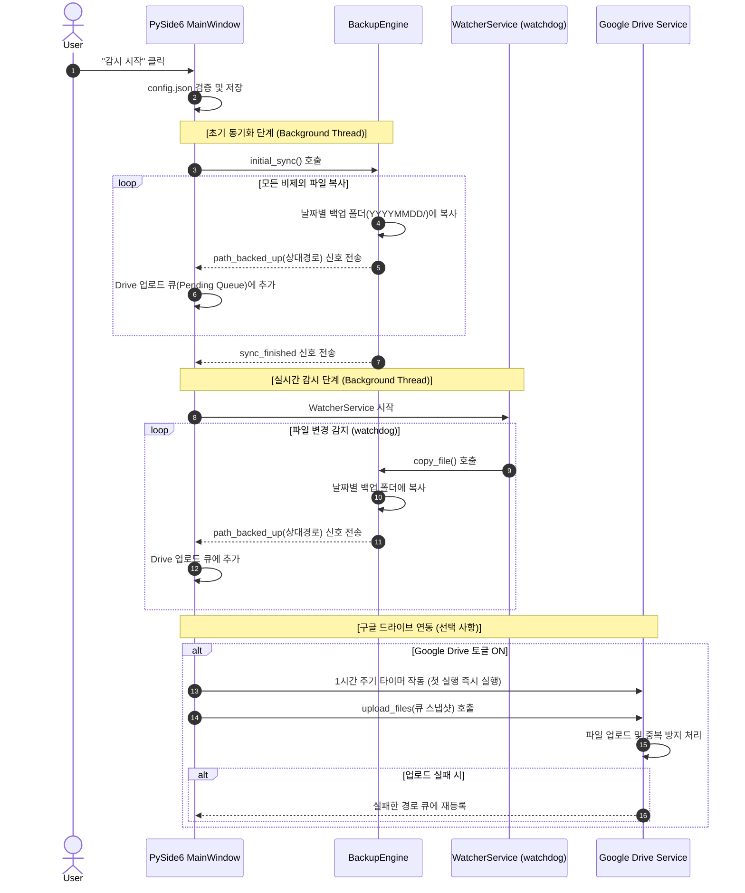

# 📂 실시간 폴더 백업 (Real-time Folder Backup & Google Drive Sync)

> **Python + PySide6** 기반의 실시간 디렉토리 감시 및 누적 백업 데스크톱 애플리케이션입니다. 지정한 소스 폴더의 변경 사항을 실시간으로 감지하여 안전하게 날짜별로 백업하고, 선택 시 1시간 주기로 Google Drive에 미러링합니다.

---

## ✨ 핵심 기능

1. **실시간 폴더 감시**: `watchdog` 라이브러리를 이용하여 소스 디렉토리의 파일 추가 및 수정을 실시간으로 감지하고 백업합니다.
2. **날짜별 누적 백업 (안전 모드)**: 
   - 백업 저장 디렉토리 아래에 **날짜별 하위 폴더(`YYYYMMDD/`)**를 자동으로 생성하여 저장합니다.
   - 원본에서 파일이 삭제되거나 이동되어도 **백업본은 절대 삭제되지 않는** 누적 방식으로 데이터를 안전하게 보호합니다.
3. **포함/제외 필터링**:
   - **제외(Exclude)**: 사용자 정의 Glob 패턴(예: `*.tmp`, `node_modules/`)을 등록하여 불필요한 백업을 차단합니다.
   - **포함(Include)**: 지정 패턴이 있으면 매칭되는 파일/디렉토리만 백업합니다(비어 있으면 전체 대상). 패턴은 경로 구분자(`/`)·와일드카드 유무에 따라 매칭 범위가 달라집니다(전체 경로 / 모든 경로 구성요소 / 디렉토리명·루트 직속 파일).
   - MS Office 임시/잠금 파일(`~$*`, `*.tmp`, 8자리 16진수 임시 파일 등)은 시스템에서 **자동으로 필터링**합니다.
4. **Google Drive 미러링**:
   - OAuth 2.0 데스크톱 앱 흐름을 통한 안전한 구글 계정 연동을 지원합니다.
   - **1시간 주기로 변경 및 추가된 파일만** 선택적으로 업로드하여 네트워크 대역폭을 절약합니다.
   - 드라이브 상의 동일한 파일/폴더는 덮어쓰기 및 재사용하여 중복 생성을 방지합니다.
5. **무한 복사 방지**: 소스 디렉토리와 백업 대상 디렉토리가 서로 같거나 포함 관계일 수 없도록 사전 유효성 검사를 수행합니다.
6. **시스템 트레이 모드**: 창을 닫아도 백그라운드에서 백업 작업이 지속되며, 시스템 트레이 아이콘을 통해 상태를 제어하고 풍선 알림으로 백업 상황을 받아볼 수 있습니다.
7. **일 단위 로그 보존**: `log/` 폴더 내에 일자별 세션 로그 파일(`backup_YYYYMMDD.log`)이 기록됩니다.

---

## 🏗️ 아키텍처 및 데이터 흐름

### 스레딩 모델 (Multi-Threading)
UI 렌더링을 담당하는 메인 스레드와 무거운 연산(초기 동기화, 실시간 감시, 구글 드라이브 업로드)을 처리하는 백그라운드 스레드가 분리되어 있습니다. 스레드 간 모든 통신은 `WorkerSignals`를 경유한 Qt Signal-Slot 패턴을 사용하여 안전하게 구현되었습니다.

### 데이터 흐름도



---

## 📂 프로젝트 구조

```
backup-tool/
├── main.py              # 애플리케이션 엔트리포인트 (Windows AppID, Exception Hook 등 설정)
├── requirements.txt     # 의존성 패키지 명세
├── config.json          # UI 설정 저장 파일 (소스/백업 경로, 제외 패턴 등)
├── todo.txt             # 향후 개선 항목 목록
├── credentials/         # 인증 키 보관 폴더
│   └── oauth_client.json # [사용자 직접 배치] Google Cloud OAuth 클라이언트 JSON 키
│                         # (로그인 토큰은 파일이 아니라 Windows 자격 증명 관리자에 DPAPI 암호화 저장)
├── log/                 # 일자별 동작 로그 폴더
├── assets/             # 앱 아이콘(icon.svg)
└── app/
    ├── errors.py        # 커스텀 예외 정의 클래스
    ├── config.py        # 백업 설정 모델 및 파일 입출력 검증
    ├── backup_engine.py # 파일 복사, 포함/제외 조건 적용, 초기 동기화 엔진
    ├── watcher.py       # watchdog 래퍼를 활용한 실시간 변경 감시 서비스
    ├── gdrive.py        # Google Drive API 연동 (인증은 허브 공유 모듈 hub_auth 에 위임)
    ├── logger.py        # 일자별 rotating 세션 로거
    ├── runtime_state.py # 실행 상태(pid·watching·gdrive_enabled)를 runtime_state.json 에 기록 → 허브가 감지
    └── ui/
        ├── signals.py   # 백그라운드 스레드와 UI 스레드를 잇는 Qt 신호 브리지
        ├── palette.py   # 테마 색상 팔레트
        ├── style.py     # 전역 스타일/테마 적용
        └── main_window.py # PySide6 기반 메인 화면 UI 및 상태 관리
```

> 인증 토큰은 허브 워크스페이스(`auto/`)의 공유 모듈(`hub_auth` / `secure_store`)을 통해 Windows 자격 증명 관리자에 저장·공유됩니다. 허브나 다른 앱에서 로그인하면 이 앱도 같은 세션을 사용합니다.

---

## 🛠️ 설치 및 실행 방법

### 1. 의존성 패키지 설치
Python 3.8 이상이 필요합니다. 터미널에서 다음 명령어를 실행하여 필요한 패키지를 설치합니다.
```bash
pip install -r requirements.txt
```

### 2. 애플리케이션 실행
```bash
python main.py
```

---

## ⚙️ Google Drive 연동 가이드

구글 드라이브 백업 기능을 사용하려면 Google Cloud Console에서 데스크톱 OAuth 클라이언트 자격 증명을 발급받아야 합니다.

### 사전 설정 단계

1. **[Google Cloud Console](https://console.cloud.google.com/)**에 로그인하고 프로젝트를 생성합니다.
2. **API 및 서비스 → 라이브러리**에서 **"Google Drive API"**를 검색하여 사용 설정(Enable)합니다.
3. **OAuth 동의 화면 (Consent Screen)** 설정:
   - User Type을 **External**로 지정합니다.
   - **테스트 사용자 (Test Users)** 단계에서 본인의 구글 계정(Gmail)을 등록해야 합니다 (등록하지 않을 경우 로그인 단계에서 인증 거부 오류 발생).
4. **사용자 인증 정보 (Credentials) 생성**:
   - **+ 사용자 인증 정보 만들기 → OAuth 클라이언트 ID**를 선택합니다.
   - 애플리케이션 유형을 **"데스크톱 앱(Desktop App)"**으로 선택하고 생성합니다.
5. **키 다운로드 및 위치 설정**:
   - 생성된 클라이언트 ID의 JSON 키 파일을 다운로드합니다.
   - 다운로드한 파일 이름을 **`oauth_client.json`**으로 변경하여 프로젝트의 `credentials/` 폴더 내부에 위치시킵니다.
6. **대상 폴더 설정**:
   - 코드를 수정할 필요 없이, 앱의 **구글 드라이브 연동** 영역에서 **"업로드 폴더 선택"** 버튼을 눌러 내 드라이브의 폴더를 탐색하며 업로드 대상 폴더를 고릅니다.
   - 선택한 폴더는 `config.json`에 저장되어 다음 실행 시 그대로 유지됩니다. 지정하지 않으면 **내 드라이브 최상위**에 업로드됩니다.

> [!WARNING]
> `oauth_client.json` 파일에는 민감한 API 비밀키가 포함되어 있으므로 **절대로 GitHub 같은 공용 저장소에 커밋 및 업로드해서는 안 됩니다**. 본 프로젝트는 Git 설정 시 해당 폴더가 무시되도록 처리되어 있습니다. 로그인 토큰은 파일이 아니라 Windows 자격 증명 관리자에 DPAPI로 암호화되어 저장됩니다.

### 연동 동작
- UI에서 구글 드라이브 토글을 켜면 웹 브라우저가 열리며 Google 로그인이 시작됩니다. 
- 한 번 승인되면 OAuth 토큰이 Windows 자격 증명 관리자에 암호화 저장되어 다음 실행 시 로그인 단계를 건너뛰고 자동으로 연결됩니다.
- 토글을 끄면 자격 증명 관리자의 토큰이 삭제되고 토큰 만료 요청이 Google 서버로 전송됩니다.

---

## 💡 사용 가이드

1. **경로 지정**: '백업 대상 디렉토리'와 '백업 저장 디렉토리'를 입력하거나 **찾아보기** 버튼을 통해 지정합니다.
2. **필터 설정**: 백업하지 않을 폴더명이나 파일 패턴(예: `.git`, `build/`, `*.log`)을 제외 목록에 입력하고 추가합니다.
3. **작업 시작**: **감시 시작** 버튼을 누르면 먼저 전체 초기 동기화가 진행된 후 백그라운드에서 실시간 변경 감시가 실행됩니다.
4. **화면 잠금**: 감시가 시작되면 경로 수정이나 필터 편집, 드라이브 토글 클릭이 비활성화됩니다. 설정을 바꾸려면 **감시 중지**를 누르십시오.
5. **백그라운드 유지**: 창의 X 버튼을 눌러 닫을 때 **트레이로 보내기**를 선택하면, 창이 최소화된 상태로 작업표시줄 트레이에서 감시와 구글 백업을 계속 진행합니다.

---

## 🚀 향후 로드맵 (Roadmap)

`todo.txt`를 기반으로 설계된 다음 릴리즈의 개선 예정 항목입니다.

- [x] **작업 범위 옵션 다각화**:
  - 기존의 제외(Exclude) 방식 외에 특정 폴더/파일만 선택하여 백업하는 포함(Include) 옵션 분리. *(구현 완료)*
- [ ] **GUI 레이아웃 고도화**:
  - 창 크기 조절 시 설정 컨트롤 크기는 유지하고 로그 출력 창(Log View) 영역만 동적으로 늘어나도록 레이아웃 수정.
- [ ] **원클릭 설정 초기화**:
  - 지정 디렉토리, 구글 드라이브 계정 토큰, 제외/포함 목록 등 모든 세팅을 한번에 클리어하는 '설정 초기화' 버튼 추가 (감시 중지 상태에서만 클릭 가능).
