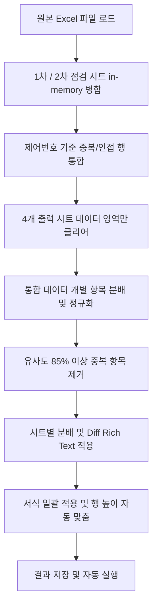

# 📊 학위논문 오류 리스트 자동 분류기 (Excel Auto-Classifier)

> **Python + openpyxl** 기반의 학위논문 오류 리스트를 분석·자동 분류하여 여러 점검 단계(1차, 2차, 3차, 품질점검)로 균등 분배하고 시각적 차이(Diff)를 강조해주는 문서 처리 자동화 도구입니다. 사용자 편의를 위한 **CLI** 및 **Tkinter GUI**를 모두 지원합니다.

---

## ✨ 핵심 기능

1. **제어번호 기준 데이터 병합 (In-Memory Merge)**:
   - 1차 점검 및 2차 점검 시트의 로우(raw) 데이터를 읽어 **제어번호(B열)** 기준으로 병합합니다.
   - 단일 제어번호에 대해 여러 오류가 쪼개져 있는 신규 포맷(1행 1오류)과 구 포맷(1행 다오류)을 모두 완벽하게 호환하여 처리합니다.
   - 데이터 순서는 원본 순서(1차 점검 우선 ➡️ 2차 점검만 존재하는 제어번호 순)를 보존합니다.
2. **유사도 기반 중복 항목 자동 제거**:
   - `difflib.SequenceMatcher`를 활용하여 동일 제어번호 내에 수정 전/후의 평균 유사도가 **85% 이상**인 유사한 중복 데이터는 자동으로 제거하여 검수 효율을 높입니다.
3. **우선순위 기반 분배 알고리즘**:
   - **3차 점검** 및 **품질점검** 단계에는 검토 효율이 높은 **"오탈자"**, **"띄어쓰기"** 유형을 우선적으로 배정합니다.
   - 그 외의 난이도가 있는 오류 유형은 **2차 점검** 단계로 이관하여 균형 있는 분배를 실현합니다.
   - 오류 유형별 최대 개수(기본 5개) 및 행당 최대 처리 한도(기본 5개) 제한을 적용하여 분량을 제한합니다.
4. **시각적 Diff 강조 (Rich Text)**:
   - 수정 전 ➡️ 수정 후 대비 변경된 글자 부분을 **빨간색**으로 강조하여 보여줍니다 (단일 항목인 경우 셀 내 Rich Text 서식 자동 적용).
   - "추가·삭제" 유형의 경우 수정 후에 자동으로 "추가" 접두사를 부여하고 강조 처리합니다.
5. **서식 보존 및 스타일 일괄 적용**:
   - 데이터를 기록할 때 셀 구조를 깨뜨리지 않고(행 삭제/추가 없이) 셀 값만 지운 후 채워 넣으므로 **기존 스타일(테두리, 색상 등)이 그대로 유지**됩니다.
   - 작업 완료 단계에서 얇은 테두리(Thin Border) 정렬, 줄바꿈(Wrap Text), 내용 길이에 맞춘 **행 높이 자동 맞춤**을 일괄 적용합니다.

---

## ⚙️ 작동 원리 (Data Pipeline)



---

## 📂 프로젝트 구조

```
error_list_dist/
├── error_list_auto_classify.py # 자동 분류 및 openpyxl 엑셀 처리 핵심 비즈니스 로직 (CLI)
├── error_list_gui.py           # Tkinter 기반 비동기 실행 GUI 래퍼
├── error_list_gui.spec         # PyInstaller 빌드 스펙 파일
├── error_list_auto_classify_분석.md # 세부 코드 기능 분석 보고서
└── README.md                   # 본 프로젝트 설명 문서
```

---

## 🚀 설치 및 사용 방법

### 1. 패키지 설치
Excel 핸들링을 위한 `openpyxl` 라이브러리가 필요합니다.
```bash
pip install openpyxl
```

### 2. CLI 실행 방법
터미널 환경에서 파이썬 명령어로 단독 실행할 수 있으며, 원본 파일명 뒤에 `_자동분류`가 붙은 결과 파일이 생성됩니다.
```bash
python error_list_auto_classify.py "학위논문_오류리스트.xlsx"
```

### 3. GUI 실행 방법
간편하게 현재 작업 디렉토리의 파일 목록을 새로고침하고, 클릭 한 번으로 자동 분류 작업을 실행합니다. 작업 완료 시 생성된 결과 엑셀 파일이 컴퓨터의 기본 프로그램으로 자동 실행됩니다.
```bash
python error_list_gui.py
```

---

## 📋 세부 단계별 분배 상세 규칙

* **오류 유형 정규화**: 입력 데이터의 오타 또는 명칭 불일치("링크오류" ➡️ "링크", "책갈피추가" ➡️ "추가·삭제")를 전처리합니다.
* **시트별 세부 분배 정책**:
  * **1차 점검 시트**: 제어번호별 병합된 전체 리스트 중 가장 앞선 **1개 항목**을 배정합니다.
  * **3차 점검 시트**: 남은 항목 중 **"오탈자"** 혹은 **"띄어쓰기"** 1순위로 **1개 항목**을 추출하여 배정합니다. (해당 사항이 없으면 2차 점검으로 이월)
  * **품질점검 시트**: 3차 점검에 배정되고 남은 오탈자/띄어쓰기 항목 중 **1개 항목**을 우선 배정합니다. (해당 사항이 없으면 2차 점검으로 이월)
  * **2차 점검 시트**: 위 단계들에서 배정되지 못하고 남은 모든 잔여 오류 항목들을 수집하여 배정합니다.

> [!TIP]
> Excel을 실행하고 있을 때 생성되는 임시 락 파일(`~$*.xlsx`)은 GUI 파일 탐색 목록에서 자동으로 감지 및 필터링되어 제외되므로 안심하고 사용하셔도 됩니다.
