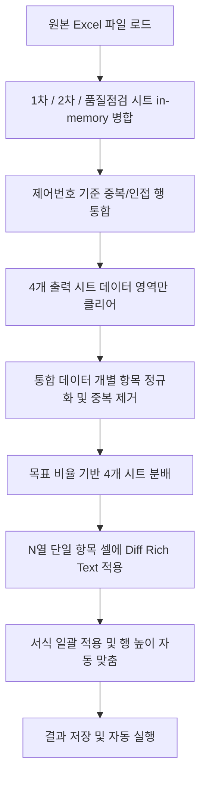

# 📊 학위논문 오류 리스트 자동 분류기 (Excel Auto-Classifier)

> **Python + openpyxl** 기반의 학위논문 오류 리스트를 분석·자동 분류하여 여러 점검 단계(1차, 2차, 3차, 품질점검)로 목표 비율에 맞춰 분배하고 시각적 차이(Diff)를 강조해주는 문서 처리 자동화 도구입니다. 사용자 편의를 위한 **CLI** 및 **PySide6 GUI**를 모두 지원합니다.

---

## ✨ 핵심 기능

1. **제어번호 기준 데이터 병합 (In-Memory Merge)**:
   - **1차 점검·2차 점검·품질점검** 시트의 로우(raw) 데이터를 읽어 **제어번호(B열)** 기준으로 병합합니다. (3차 점검은 출력 전용 시트)
   - 단일 제어번호에 대해 여러 오류가 쪼개져 있는 신규 포맷(1행 1오류)과 구 포맷(1행 다오류)을 모두 완벽하게 호환하여 처리합니다.
   - 데이터 순서는 원본 등장 순서(1차 ➡️ 2차 ➡️ 품질점검에만 존재하는 제어번호 순)를 보존합니다.
2. **유사도 기반 중복 항목 자동 제거**:
   - `difflib.SequenceMatcher`를 활용하여 동일 제어번호 내에 수정 전/후의 평균 유사도가 **85% 이상**인 유사한 중복 데이터는 자동으로 제거하여 검수 효율을 높입니다.
   - 변경 패턴 서명·교차 스크립트(한글↔한자) 변환·연속 목록 번호 등도 중복으로 판단해 정리합니다.
3. **목표 비율(쿼터) 기반 분배 알고리즘**:
   - 각 시트는 **전체 행 대비 목표 비율**(1차 80% · 2차 40% · 3차 20% · 품질 10%)을 기준으로 분배됩니다.
   - **1차 점검**은 상한 없는 catch-all로, 항목이 있으면 우선 채우고 다른 시트 쿼터를 넘긴 잉여 항목까지 모두 흡수합니다(데이터 손실 방지).
   - **2·3·4차**는 행 진행도에 비례한 목표치에 가장 뒤처진 시트부터 한 항목씩 채워 비율에 수렴시키며, **3차·품질점검**은 검토 효율이 높은 **"오탈자"·"띄어쓰기"** 유형만 받습니다.
   - 오류 유형별 최대 개수(기본 5개) 및 행당 최대 처리 한도(기본 5개) 제한을 적용하여 분량을 제한합니다.
4. **시각적 Diff 강조 (Rich Text)**:
   - 수정 전 ➡️ 수정 후 대비 변경된 글자 부분을 **빨간색**으로 강조하여 보여줍니다 (단일 항목인 경우 셀 내 Rich Text 서식 자동 적용).
   - "추가·삭제" 유형의 경우 수정 후에 자동으로 "추가" 접두사를 부여하고 강조 처리합니다.
5. **서식 보존 및 스타일 일괄 적용**:
   - 데이터를 기록할 때 셀 구조를 깨뜨리지 않고(행 삭제/추가 없이) 셀 값만 지운 후 채워 넣으므로 **기존 스타일(테두리, 색상 등)이 그대로 유지**됩니다.
   - 작업 완료 단계에서 얇은 테두리(Thin Border) 정렬, 줄바꿈(Wrap Text), 내용 길이에 맞춘 **행 높이 자동 맞춤**을 일괄 적용합니다.

---

## ⚙️ 작동 원리 (Data Pipeline)



---

## 📂 프로젝트 구조

```
error_list_dist/
├── error_list_auto_classify.py # 자동 분류·분배·Diff 핵심 엔진 (CLI + process_error_list)
├── error_list_gui.py           # gui 패키지 진입 shim (python error_list_gui.py)
├── pyproject.toml / uv.lock    # 의존성 정의 (uv)
├── config.json                 # 테마 등 설정
├── gui/                        # PySide6 GUI 패키지
│   ├── app.py                  # 메인 창(ErrorListApp) + main(); 실행 상태 파일 등록
│   ├── worker.py               # ClassifyWorker (QThread) — 엔진 비동기 실행
│   ├── paths.py                # sys.path 부트스트랩
│   └── config.py · style.py · palette.py · fonts.py · dialogs.py · utils.py
├── fonts/                      # 번들 폰트
└── README.md                   # 본 프로젝트 설명 문서
```

---

## 🚀 설치 및 사용 방법

### 1. 패키지 설치
의존성은 `uv`로 관리합니다(`pyproject.toml`). 폴더에서 다음을 실행하면 `.venv`가 생성됩니다.
```bash
uv sync
```

### 2. CLI 실행 방법
터미널 환경에서 단독 실행할 수 있으며, 원본 파일명 뒤에 `_자동분류`가 붙은 결과 파일이 생성됩니다.
```bash
uv run python error_list_auto_classify.py "학위논문_오류리스트.xlsx"
```

### 3. GUI 실행 방법
현재 작업 디렉토리의 `.xlsx` 파일 목록을 보여주고(출력물·임시파일 제외), 클릭 한 번으로 자동 분류를 실행합니다. 작업 완료 시 생성된 결과 엑셀 파일이 기본 프로그램으로 자동 실행됩니다.
```bash
uv run python error_list_gui.py   # 또는: uv run gui
```

---

## 📋 세부 단계별 분배 상세 규칙

* **오류 유형 정규화**: 입력 데이터의 오타 또는 명칭 불일치("링크오류" ➡️ "링크", "책갈피추가" ➡️ "추가·삭제")를 전처리합니다.
* **시트별 목표 비율(쿼터)**: 전체 행 대비 — **1차 80% · 2차 40% · 3차 20% · 품질점검 10%**.
* **행 단위 분배 정책** (제어번호 한 행을 처리할 때마다):
  1. **1차 점검 시트**: 항목이 있으면 가장 앞선 **1개 항목**을 우선 배정합니다(상한 없음).
  2. **2·3·4차 시트**: 현재 행 위치까지의 목표 누적치(목표 비율 × 진행 행수)에 **가장 뒤처진 시트부터** 한 항목씩 채웁니다. 각 시트는 한 행에서 최대 1회 배정되며, **3차·품질점검은 "오탈자"·"띄어쓰기" 유형만** 받습니다.
  3. **잉여 항목**: 위에서 배정되지 못하고 남은 항목은 모두 **1차 점검**으로 흡수하여 데이터 손실을 방지합니다.
  > 이렇게 행 진행도에 비례해 채우므로, 앞쪽 행이 쿼터를 모두 소진해 뒤쪽 행이 비는 현상 없이 처음부터 끝까지 고르게 분포됩니다.

> [!TIP]
> Excel을 실행하고 있을 때 생성되는 임시 락 파일(`~$*.xlsx`)은 GUI 파일 탐색 목록에서 자동으로 감지 및 필터링되어 제외되므로 안심하고 사용하셔도 됩니다.
